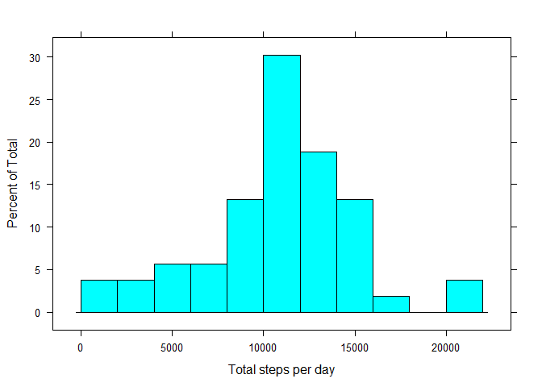
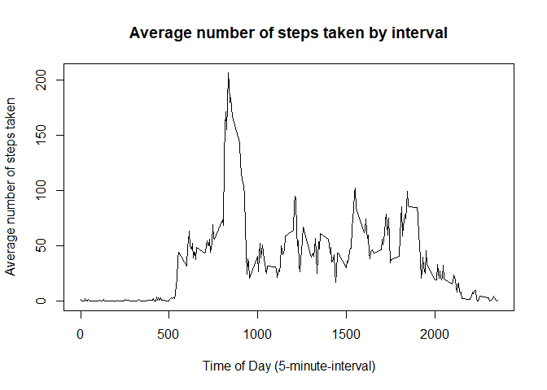
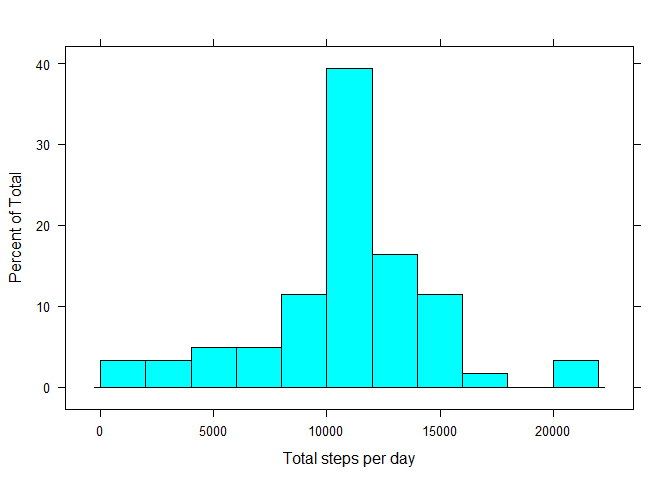
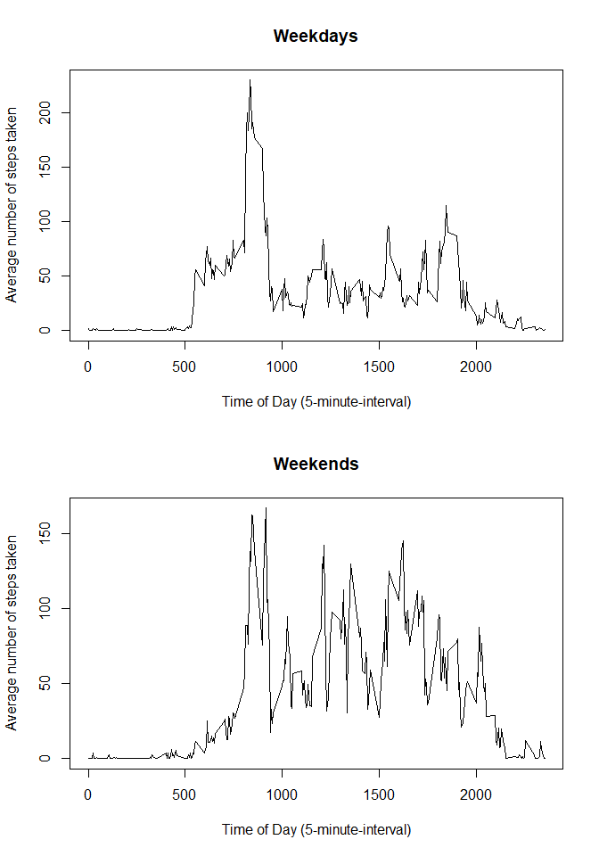

It is now possible to collect a large amount of data about personal movement using activity monitoring devices such as a Fitbit, Nike Fuelband, or Jawbone Up. These type of devices are part of the “quantified self” movement – a group of enthusiasts who take measurements about themselves regularly to improve their health, to find patterns in their behavior, or because they are tech geeks. But these data remain under-utilized both because the raw data are hard to obtain and there is a lack of statistical methods and software for processing and interpreting the data.

This assignment makes use of data from a personal activity monitoring device. This device collects data at 5 minute intervals through out the day. The data consists of two months of data from an anonymous individual collected during the months of October and November, 2012 and include the number of steps taken in 5 minute intervals each day.

## Loading and preprocessing the data.

This data can be downloaded from the course web site:  

- Dataset: [Activity monitoring data](https://d396qusza40orc.cloudfront.net/repdata%2Fdata%2Factivity.zip)  

The variables included in this dataset are:  

- **steps**: Number of steps taking in a 5-minute interval (missing values are coded as *NA*)  
- **date**: The date on which the measurement was taken in YYYY-MM-DD format  
- **interval**: Identifier for the 5-minute interval in which measurement was taken  

So, first, I load the dataset into RStudio.


```r
df <- read.csv("activity.csv",
                 sep = ",",
                 header = TRUE)
str(df)
```

```
## 'data.frame':	17568 obs. of  3 variables:
##  $ steps   : int  NA NA NA NA NA NA NA NA NA NA ...
##  $ date    : Factor w/ 61 levels "2012-10-01","2012-10-02",..: 1 1 1 1 1 1 1 1 1 1 ...
##  $ interval: int  0 5 10 15 20 25 30 35 40 45 ...
```

```r
head(df)
```

```
##   steps       date interval
## 1    NA 2012-10-01        0
## 2    NA 2012-10-01        5
## 3    NA 2012-10-01       10
## 4    NA 2012-10-01       15
## 5    NA 2012-10-01       20
## 6    NA 2012-10-01       25
```

As we can see in the str() results, the *date* variable is still formatted as Factor. Let us change it to the proper Date formatting.


```r
#library(lubridate)
df$date <- as.Date(as.factor(df$date), format = "%Y-%m-%d")
str(df)
```

```
## 'data.frame':	17568 obs. of  3 variables:
##  $ steps   : int  NA NA NA NA NA NA NA NA NA NA ...
##  $ date    : Date, format: "2012-10-01" "2012-10-01" ...
##  $ interval: int  0 5 10 15 20 25 30 35 40 45 ...
```

```r
head(df)
```

```
##   steps       date interval
## 1    NA 2012-10-01        0
## 2    NA 2012-10-01        5
## 3    NA 2012-10-01       10
## 4    NA 2012-10-01       15
## 5    NA 2012-10-01       20
## 6    NA 2012-10-01       25
```


```r
library(lubridate)
```

```
## Warning: package 'lubridate' was built under R version 3.6.3
```

```
## 
## Attaching package: 'lubridate'
```

```
## The following object is masked from 'package:base':
## 
##     date
```

```r
df$wday <- wday(df$date)
df$wday_label <- wday(df$date, label = TRUE, abbr = FALSE)
head(df)
```

```
##   steps       date interval wday wday_label
## 1    NA 2012-10-01        0    2     Monday
## 2    NA 2012-10-01        5    2     Monday
## 3    NA 2012-10-01       10    2     Monday
## 4    NA 2012-10-01       15    2     Monday
## 5    NA 2012-10-01       20    2     Monday
## 6    NA 2012-10-01       25    2     Monday
```

Second, we will have to first convert the *date* variable to a *day-of-month* variable. 

```r
df$day <- day(df$date)
table(df$day)
```

```
## 
##   1   2   3   4   5   6   7   8   9  10  11  12  13  14  15  16  17  18  19  20 
## 576 576 576 576 576 576 576 576 576 576 576 576 576 576 576 576 576 576 576 576 
##  21  22  23  24  25  26  27  28  29  30  31 
## 576 576 576 576 576 576 576 576 576 576 288
```

```r
#head(df)
```

## What is the mean total number of steps taken per day?

This section addresses the first question. Specifically, missing values are ignored in this part.

### Calculate the total number of steps taken per day

The total number of steps taken per day can be calculated using the aggregate() or tapply(..., FUN=sum) functions, among others. For this purpose, I will use the aggregate() function.

Note that in the above table, median is seen as 0 because even if NAs are removed, there are still times of day where our steps would be 0 (e.g., when sleeping).


```r
library(dplyr)
```

```
## Warning: package 'dplyr' was built under R version 3.6.3
```

```
## 
## Attaching package: 'dplyr'
```

```
## The following objects are masked from 'package:lubridate':
## 
##     intersect, setdiff, union
```

```
## The following objects are masked from 'package:stats':
## 
##     filter, lag
```

```
## The following objects are masked from 'package:base':
## 
##     intersect, setdiff, setequal, union
```

```r
ind_date <- subset(df, !is.na(df[, "steps"])) %>%
        group_by(date) %>%
        summarise(
                #mean.steps = mean(steps, na.rm = T),
                #median.steps = median(steps, na_rm = T),
                sum.steps = sum(steps, na_rm = T)
        )
ind_date
```

```
## # A tibble: 53 x 2
##    date       sum.steps
##    <date>         <int>
##  1 2012-10-02       127
##  2 2012-10-03     11353
##  3 2012-10-04     12117
##  4 2012-10-05     13295
##  5 2012-10-06     15421
##  6 2012-10-07     11016
##  7 2012-10-09     12812
##  8 2012-10-10      9901
##  9 2012-10-11     10305
## 10 2012-10-12     17383
## # ... with 43 more rows
```

### Construct a histogram for each day on the total number of steps taken each day.

I will be using a lattice plotting system here. I will be plotting it by aggregating the total of steps by individual dates. 


```r
library(lattice)
histogram(~ sum.steps,
          data = ind_date,
          breaks = 10,
          xlab = "Total steps per day")
```

<!-- -->

### Calculate and report the mean and median of the total number of steps taken per day

Below is the calculated total steps per day.


```r
ind_date
```

```
## # A tibble: 53 x 2
##    date       sum.steps
##    <date>         <int>
##  1 2012-10-02       127
##  2 2012-10-03     11353
##  3 2012-10-04     12117
##  4 2012-10-05     13295
##  5 2012-10-06     15421
##  6 2012-10-07     11016
##  7 2012-10-09     12812
##  8 2012-10-10      9901
##  9 2012-10-11     10305
## 10 2012-10-12     17383
## # ... with 43 more rows
```

In aggregate, the mean and median could be seen in the following summary.


```r
summary(ind_date$sum.steps)
```

```
##    Min. 1st Qu.  Median    Mean 3rd Qu.    Max. 
##      42    8842   10766   10767   13295   21195
```


## What is the average daily activity pattern?

### Make a time series plot (i.e., line plot) of the 5-minute interval (x-axis) and the average number of steps taken, averaged across all days (y-axis)


```r
df2 <- subset(df, !is.na(df[, "steps"])) %>%
        group_by(interval) %>%
        summarise(
                mean.steps = mean(steps, na.rm = T)
        )

plot(df2$interval, df2$mean.steps,
     type = "l",
     xlab = "Time of Day (5-minute-interval)",
     ylab = "Average number of steps taken",
     main = "Average number of steps taken by interval")
```

<!-- -->


Meanwhile, the interval with most steps are calculated as follow:


```r
max_steps <- which.max(df2$mean.steps)
print(paste("The average steps in a day is found on the ", df2$interval[max_steps], "th interval in the day", sep = ""))
```

```
## [1] "The average steps in a day is found on the 835th interval in the day"
```


## Imputing Missing Values

Calculate and report the total number of missing values in the dataset (i.e. the total number of rows with NA


```r
sum(is.na(df$steps))
```

```
## [1] 2304
```

```r
print(paste("The number of NA value in the steps variable is in total", sum(is.na(df$steps)), "occurrences"))
```

```
## [1] "The number of NA value in the steps variable is in total 2304 occurrences"
```

Devise a strategy for filling in all of the missing values in the dataset. The strategy does not need to be sophisticated. For example, you could use the mean/median for that day, or the mean for that 5-minute interval, etc.

In this part, I will impute the missing value by *the mean of such interval across all dates*.


```r
library(dplyr)
impute.mean <- function(x) replace(x, is.na(x), mean(x,
                                                     na.rm = T))
df_impute <- df %>%
        group_by(interval) %>%
        mutate(
                steps = impute.mean(steps)
        )

head(df_impute)
```

```
## # A tibble: 6 x 6
## # Groups:   interval [6]
##    steps date       interval  wday wday_label   day
##    <dbl> <date>        <int> <dbl> <ord>      <int>
## 1 1.72   2012-10-01        0     2 Monday         1
## 2 0.340  2012-10-01        5     2 Monday         1
## 3 0.132  2012-10-01       10     2 Monday         1
## 4 0.151  2012-10-01       15     2 Monday         1
## 5 0.0755 2012-10-01       20     2 Monday         1
## 6 2.09   2012-10-01       25     2 Monday         1
```

### Make a histogram of the total number of steps taken each day and 

First, we calculate the sum of steps per day using the new data.


```r
library(dplyr)
ind_date_imputed <- df_impute %>%
        group_by(date) %>%
        summarise(
                #mean.steps = mean(steps, na.rm = T),
                #median.steps = median(steps, na_rm = T),
                sum.steps = sum(steps, na_rm = T)
        )
```

Then, the histogram:


```r
library(lattice)
histogram(~ sum.steps,
          data = ind_date_imputed,
          breaks = 10,
          xlab = "Total steps per day")
```

<!-- -->


### Calculate and report the mean and median total number of steps taken per day. 

Here, we take the summary of total steps from the aggregated newly imputed dataset.


```r
summary(ind_date_imputed$sum.steps)
```

```
##    Min. 1st Qu.  Median    Mean 3rd Qu.    Max. 
##      42    9820   10767   10767   12812   21195
```

Comparing to the original dataset..


```r
summary(ind_date$sum.steps)
```

```
##    Min. 1st Qu.  Median    Mean 3rd Qu.    Max. 
##      42    8842   10766   10767   13295   21195
```


We can see that the median slightly changed and converged to the mean.

## Are there differences in activity patterns between weekdays and weekends?

For this part, we will create a weekend/weekday dummy. Recall that we have previously created a day-of-week variable called wday and wday_label.


```r
df_impute[,c("date", "wday", "wday_label")]
```

```
## # A tibble: 17,568 x 3
##    date        wday wday_label
##    <date>     <dbl> <ord>     
##  1 2012-10-01     2 Monday    
##  2 2012-10-01     2 Monday    
##  3 2012-10-01     2 Monday    
##  4 2012-10-01     2 Monday    
##  5 2012-10-01     2 Monday    
##  6 2012-10-01     2 Monday    
##  7 2012-10-01     2 Monday    
##  8 2012-10-01     2 Monday    
##  9 2012-10-01     2 Monday    
## 10 2012-10-01     2 Monday    
## # ... with 17,558 more rows
```
We can simply create a dummy using the ifelse() fucntion.


```r
df_impute$d_weekend <- ifelse(df_impute$wday_label == "Sunday" | df_impute$wday_label == "Saturday", 1, 0)
table(df_impute$wday_label,
      df_impute$d_weekend)
```

```
##            
##                0    1
##   Sunday       0 2304
##   Monday    2592    0
##   Tuesday   2592    0
##   Wednesday 2592    0
##   Thursday  2592    0
##   Friday    2592    0
##   Saturday     0 2304
```

We then convert it to factor variable:


```r
df_impute$d_weekend_factor <- factor(df_impute$d_weekend,
                                     labels = c("Weekdays",
                                                "Weekends"))
table(df_impute$wday_label,
      df_impute$d_weekend_factor)
```

```
##            
##             Weekdays Weekends
##   Sunday           0     2304
##   Monday        2592        0
##   Tuesday       2592        0
##   Wednesday     2592        0
##   Thursday      2592        0
##   Friday        2592        0
##   Saturday         0     2304
```

We proceed to make the panel plot comparing the average steps taken in by weekday/weekend:


```r
df_impute2 <- df_impute %>%
        group_by(d_weekend_factor, interval) %>%
        summarise(
                mean.steps = mean(steps, na.rm = T)
        )

par(mfrow = c(2,1))

weekday_df <- subset(df_impute2,
                     d_weekend_factor == "Weekdays")
weekend_df <- subset(df_impute2,
                     d_weekend_factor == "Weekends")

plot(weekend_df$interval, weekday_df$mean.steps,
     type = "l",
     xlab = "Time of Day (5-minute-interval)",
     ylab = "Average number of steps taken",
     main = "Weekdays")

plot(weekend_df$interval, weekend_df$mean.steps,
     type = "l",
     xlab = "Time of Day (5-minute-interval)",
     ylab = "Average number of steps taken",
     main = "Weekends")
```

<!-- -->

As seen above, people are more active walking in weekdays mornings than weekends. Further, it is also visible that in weekdays, number of steps during working / office hours are considerably lower than in weekends.
